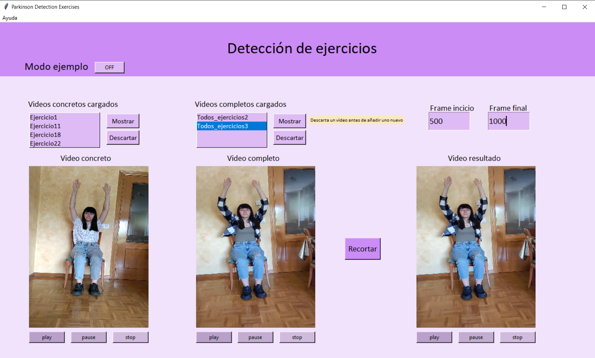

# TFG-Evaluacion-Ejercicios-Rehabilitacion

## Detección de secuencias para la evaluación de ejercicios de rehabilitación
Uso de la metodología **Dynamic Time Warping** para la detección de ejercicios en personas con enfermedades neurodegenerativas (Parkinson).
Trabajo de fin de grado de Ingeniería Informática realizado en la **Universidad de Burgos**. Minería de datos aplicada a la diagnosis del Parkinson.

* Autora: *Lucía Núñez Calvo*
* Tutores: *Dr. José Francisco Diez Pastor*, *D. José Miguel Ramírez  Sanz* y *D. José Luís Garrido Labrador*

---

## Resumen
Actualmente el mundo está caracterizado por un aumento de la esperanza de vida y una población cada vez más envejecida, esto repercute en un incremento de enfermedades, en concreto enfermedades neurodegenerativas, que es de lo que va a tratar este estudio. 
La más común es el Alzheimer y seguido de este trastorno se encuentra la enfermedad de Parkinson, afectando a una de cada 100 personas mayores de 60 años. 

La enfermedad de Parkinson es un tipo de trastorno del movimiento que se produce como resultado de la pérdida de células cerebrales productoras de dopamina. Esta enfermedad causa temblores en manos, brazos, piernas, mandíbula y cara, una rigidez en las extremidades y tronco, lentitud de movimientos e inestabilidad postural, o deterioro del equilibrio y la coordinación. 
Es muy importante que el paciente realice una terapia rehabilitadora que le permita conservar lo máximo posible sus funciones motoras y locomotoras hasta su inevitable pérdida.
Y es por esta razón que para poder permitir a los pacientes unas terapias asequibles y de buena calidad se han realizado numerosos estudios que abarcan el problema de desarrollar aplicaciones de ayuda para la enfermedad de Parkinson.

Este estudio parte de un trabajo previo realizado por los alumnos José Miguel Ramírez Sanz y José Luís Garrido Labrador. En su trabajo fin de máster se obtenía la descomposición de un vídeo en sus diferentes frames y de cada uno de ellos se sacaba el esqueleto correspondiente. En este estudio se va a partir de la obtención de cada uno de los esqueletos, que serán almacenados en forma de posiciones, para su posterior análisis.

La nueva funcionalidad añadida permite la identificación de ejercicios. A partir de una serie de vídeos grabados por pacientes y terapeutas, se realizará un análisis entre los movimientos del terapeuta y los de los pacientes. Una vez se haya obtenido el análisis de ambos vídeos, se deberá localizar el vídeo que realiza el terapeuta dentro de la secuencia de ejercicios que realiza el paciente. De esta manera se podrá observar como de correcto o preciso es el ejercicio que realiza el paciente. 

Finalmente, para poder visualizar los resultados, se ha implementado una aplicación de escritorio en la que el usuario puede observar un recorte del ejercicio que realiza el paciente. 

## Abstract
Actually the world is characterized by a life hope's increase and an older population, this has a direct impact into a disease's increase, specifically neurodegenerative diseases, this is what this study is going to be about.
The most common disease is the Alzheimer and besides this one, we have the Parkinson, which affects to one of each 100 older than 60 years person.

The Parkinson disease if a kind of movement's disorder which produces as a result of the loss of dopamine producing brain cells. This disease produces tremors in the hands, arms, legs, jaw and face, a rigidity in the extremities and the body, slower motions and postural instability, or loss of the balance and the coordination.
It's really important that the patient makes a rehabilitation therapy which will let him keep its motor and locomotor functions the best as possible until its unavoidable loss.
This is the main reason to allow the patients have an affordable and high quality therapies there have been created many studies which develops applications to help the Parkinson disease.

This study starts from a previous job made by the students José Miguel Ramírez Sanz y José Luís Garrido Labrador. In their TFM they obtained the decomposition of a video in its differents frames and from each of this ones they get its corresponding skeleton. This study starts from the obtainment of each of the skeletons, which will be stored as possitions, for its further analysis.

The new added functionality allows the identification of exercises. From a videos' series filmed by patients and therapists, there will be made an analysis between the therapist and patient's movements. When the have the analysis' results of both videos, there should be localized the therapist's video inside the exercise's sequence made by the patient. By this way there could be seen how correct or accurate is the patient's exercise.

Finally, to be able to see the results, there has been implemented a desktop application in which the user can watch a clip of the patient's exercise.

---

## Página web
https://lnc1002.github.io/TFG-Evaluacion-Ejercicios-Rehabilitacion/

## Instalaciones
### Clonar el repositorio
* `git clone https://github.com/lnc1002/TFG-Evaluacion-Ejercicios-Rehabilitacion.git`

### Demo
Ir al directorio `app/` y seguir las instrucciones indicadas en `app/README.md`. Resumidas:
* Clonar este repositorio e ir al directorio `app`.
* Descargar los pesos vídeos en cado de que no se encuentren en las carpetas.
* Instalar los requerimientos de requeriments.txt en entorno Python 3.8.8.

## Demo

